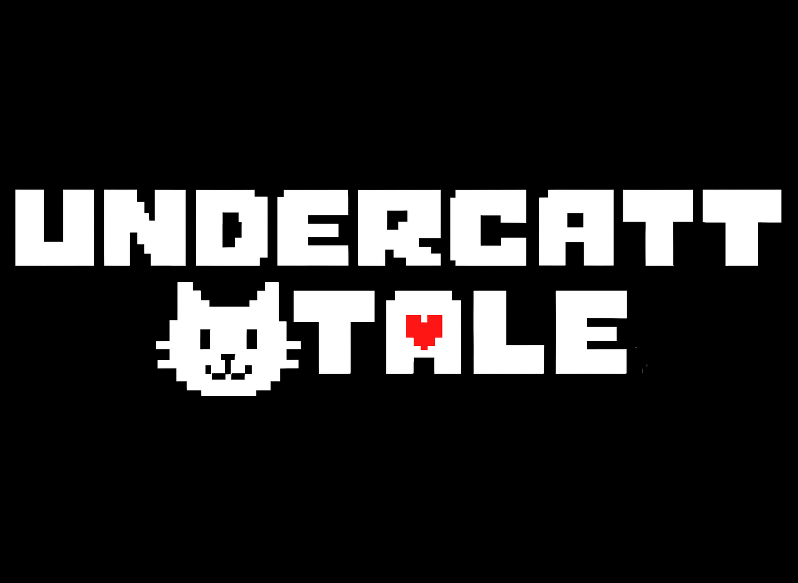

# UnderCatTale


A browser-based RPG parody game inspired by Undertale, featuring Cans - the ultimate cat boss. Experience an epic battle system with multiple attack patterns, moral choices, and dynamic music that adapts to your decisions.

## 🎬 Game Demo


https://github.com/user-attachments/assets/fe3dad13-dd57-427c-87d7-e9fc8cefa683


## 🎮 Game Features

### Core Gameplay
- **Heart-based Movement**: Navigate using WASD or arrow keys to dodge colorful attacks
- **Multiple Attack Types**: 
  - White attacks: Standard damage on contact
  - Blue attacks: Only hurt when moving
  - Orange attacks: Only hurt when standing still  
  - Green attacks: Heal the player on contact
- **Choice-driven Story**: Your actions determine the narrative path and music
- **Boss Battle System**: Face off against Cans across multiple phases

### Combat System
- **FIGHT**: Deal damage to progress through combat phases
- **ACT**: Interact with Cans to change their mood and battle dynamics
- **ITEM**: Use treats, catnip, and emergency heals strategically
- **MERCY**: Attempt to end the battle peacefully

### Advanced Features
- **Rage Mode**: Intense phase with enhanced attacks and special mechanics
- **Dynamic Music**: Soundtrack changes based on player choices (neutral/mercy/genocide routes)
- **Status Effects**: Catnip intoxication, sleepiness, and invincibility frames
- **Multilingual Support**: Switch between English and Chinese (中文)
- **Responsive Design**: Optimized for both desktop and mobile devices

## 🛠️ Technical Implementation

### Technologies Used
- **HTML5 Canvas**: Real-time 2D graphics rendering
- **Vanilla JavaScript**: Game logic and mechanics
- **CSS3**: Responsive UI design and animations
- **Web Audio API**: Dynamic music system with fade transitions

### Game Architecture
- **State Management**: Comprehensive game state handling (intro, menu, attack, dialogue, endings)
- **Animation System**: 60fps game loop with delta time calculations
- **Collision Detection**: Precise hit detection for various attack shapes
- **Audio Management**: Seamless music transitions and volume controls

## 🎵 Audio Assets

The game features original music tracks:
- `last_goodbye.mp3` - Main theme for neutral/mercy routes
- `MEGALOVANIA.mp3` - Intense battle music for genocide route

## 🚀 Getting Started

### Prerequisites
- Modern web browser with HTML5 Canvas support
- Audio playback capability

### Installation
1. Clone the repository:
   ```bash
   git clone https://github.com/WWIIITT/UnderCatTale.git
   ```

2. Navigate to the project directory:
   ```bash
   cd UnderCatTale
   ```

3. Open `index.html` in your web browser or serve via a local web server:
   ```bash
   # Using Python 3
   python -m http.server 8000
   
   # Using Node.js
   npx serve .
   ```

4. Access the game at `http://localhost:8000`

## 🎯 How to Play

### Basic Controls
- **Movement**: Arrow Keys or WASD
- **Menu Navigation**: Arrow Keys + Enter or mouse clicks
- **Continue Dialogue**: Spacebar
- **Language Toggle**: Language button in bottom-right corner

### Combat Tips
- Stay alert for attack color indicators
- Use the brief invincibility period after taking damage
- Green attacks are your friend - they heal you!
- Different moods affect Cans' attack patterns
- Emergency heals are precious in rage mode

### Routes
- **Mercy Route**: Use ACT and MERCY to befriend Cans
- **Neutral Route**: Balance fighting with peaceful actions
- **Genocide Route**: Focus on FIGHT to trigger intense battle phases

## 🏗️ Project Structure

```
UnderCatTale/
├── index.html          # Main game file with embedded CSS/JS
├── public/
│   ├── catpaw.png     # Cat paw sprite for special attacks
│   ├── last_goodbye.mp3    # Neutral route music
│   └── MEGALOVANIA.mp3     # Rage mode music
└── README.md          # Project documentation
```

## 🤝 Contributing

We welcome contributions! Here's how you can help:

1. **Bug Reports**: Submit issues with detailed reproduction steps
2. **Feature Requests**: Suggest new attacks, mechanics, or improvements
3. **Code Contributions**: Fork the repo and submit pull requests
4. **Translations**: Help add support for more languages
5. **Audio Assets**: Contribute music or sound effects

### Development Guidelines
- Maintain 60fps performance
- Ensure mobile responsiveness
- Follow existing code style
- Test across different browsers
- Document new features thoroughly


## 🙏 Acknowledgments

- Inspired by **Undertale** by Toby Fox
- Cat behavior research conducted by observing real felines
- Special thanks to all contributors and players

## 📞 Contact

- **Repository**: [https://github.com/WWIIITT/UnderCatTale](https://github.com/WWIIITT/UnderCatTale)
- **Issues**: Report bugs and request features via GitHub Issues

---

**Disclaimer:** 
- This is a fan-made project inspired by Undertale by Toby Fox. All original Undertale assets belong to their respective owners. This project is not affiliated with or endorsed by the original creators.

